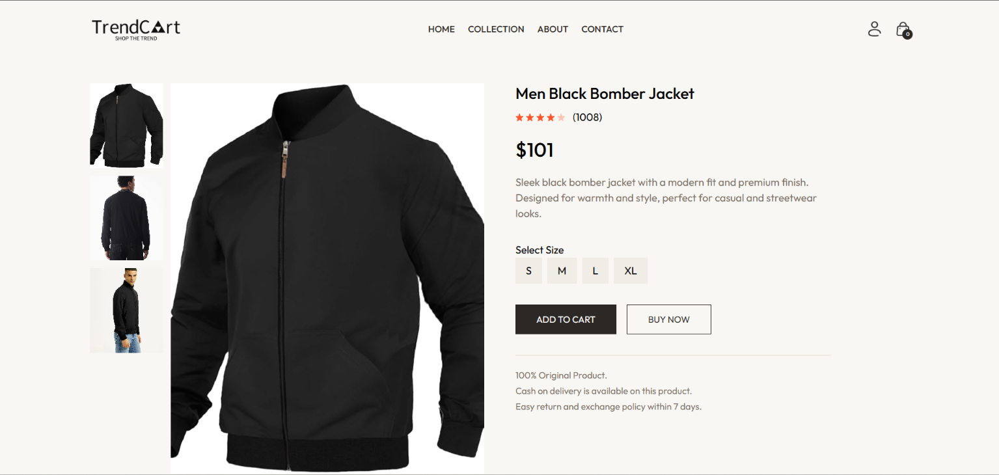
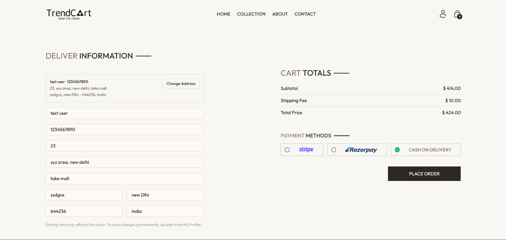
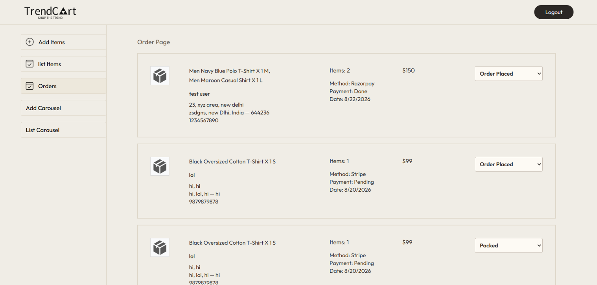

# TrendCart

A full-stack MERN e-commerce platform with secure authentication, role-based access control, payment gateway integration, Redis caching, API rate limiting, order management, and an admin dashboard.

## Overview

TrendCart is designed as a production-oriented e-commerce application focused on backend engineering, API design, performance, security, and reliable payment workflows.

The platform supports customer and admin roles, product browsing and management, cart and order workflows, payment processing through Stripe and Razorpay, Redis caching, API rate limiting, order tracking, and PDF invoice generation.

## Features

- JWT-based authentication
- Role-based access control for customers and admins
- Admin dashboard for product, order, and user management
- Product search and category-based browsing
- Cart and order management
- Stripe and Razorpay payment integration
- Secure payment webhook verification
- Redis cache-aside caching
- Write-time cache invalidation
- Redis-backed API rate limiting
- Order tracking
- Dynamic PDF invoice generation
- RESTful API architecture
- MongoDB-based data persistence
- Responsive React frontend


## Screenshots

### Home Page

<p align="center">
  
</p>

### Product Browsing

<p align="center">
  
</p>

### Product Details

<p align="center">
  
</p>

### Cart & Checkout

<p align="center">
  
</p>

### Admin Dashboard

<p align="center">
  
</p>

## Tech Stack

### Frontend

- React.js
- Redux
- Context API
- Tailwind CSS
- HTML5
- CSS3

### Backend

- Node.js
- Express.js
- RESTful APIs
- JWT Authentication
- Redis
- Mongoose

### Database

- MongoDB

### Payments

- Stripe
- Razorpay

### Tools

- Git
- GitHub
- Docker
- Postman

## Architecture

```text
                    ┌─────────────────┐
                    │   React Client  │
                    └────────┬────────┘
                             │
                             ▼
                    ┌─────────────────┐
                    │  Express API    │
                    │    / Node.js    │
                    └───────┬─────────┘
                            │
              ┌─────────────┼─────────────┐
              │             │             │
              ▼             ▼             ▼
         MongoDB         Redis       Payment APIs
                              │       ┌──────────┐
                              │       │  Stripe  │
                              │       │ Razorpay │
                              │       └──────────┘
                              │
                         Cache Layer
```

## Authentication & Authorization

TrendCart uses JWT-based authentication to secure protected routes.

```text
Customer
   │
   ├── Browse products
   ├── Manage cart
   ├── Place orders
   └── Track orders

Admin
   │
   ├── Manage products
   ├── Manage orders
   └── Manage users
```

Protected APIs verify the user's JWT before allowing access to restricted resources. Role-based authorization ensures that administrative operations are accessible only to authorized users.

## Payment Integration

TrendCart integrates both Stripe and Razorpay for payment processing.

```text
Customer
   │
   ▼
Create Order
   │
   ▼
Payment Gateway
   │
   ├── Stripe
   └── Razorpay
          │
          ▼
   Payment Verification
          │
          ▼
      Order Update
```

Payment webhook verification is used to validate payment events before updating order state.

## Redis Caching

TrendCart follows a cache-aside strategy:

```text
Request
   │
   ▼
Check Redis
   │
   ├── Cache Hit ──────► Return cached data
   │
   └── Cache Miss
          │
          ▼
       MongoDB
          │
          ▼
      Store in Redis
          │
          ▼
      Return data
```

Write-time cache invalidation is used when relevant data changes to prevent stale product and hero-slide data from remaining in the cache.

### Performance Results

Load testing with 50 concurrent connections showed:

- Up to **92% reduction in average API latency**
- Up to **12× increase in throughput**

## API Rate Limiting

TrendCart uses Redis-backed rate limiting across authentication, product, cart, order, and payment endpoints.

This helps control excessive requests and API abuse while allowing normal application usage.

## Order Management

```text
Cart
  │
  ▼
Order Creation
  │
  ▼
Payment
  │
  ▼
Payment Verification
  │
  ▼
Order Confirmation
  │
  ▼
Order Tracking
```

Customers can track their orders, while administrators can manage order status through the admin dashboard.

## PDF Invoice Generation

TrendCart dynamically generates PDF invoices containing:

- Customer information
- Order details
- Product information
- Quantities
- Pricing
- Order totals

## Project Structure

```text
TrendCart/
│
├── backend/
│   ├── controllers/
│   ├── middleware/
│   ├── models/
│   ├── routes/
│   ├── services/
│   ├── config/
│   └── server.js
│
├── frontend/
│   ├── components/
│   ├── pages/
│   ├── redux/
│   ├── context/
│   └── ...
│
└── README.md
```

## API Categories

| Category | Purpose |
|---|---|
| Authentication | Registration, login, and user authentication |
| Products | Product browsing, search, categories, and management |
| Cart | Cart creation and modification |
| Orders | Order creation and order management |
| Payments | Stripe and Razorpay payment workflows |
| Users | User and admin management |
| Tracking | Order status tracking |

## Performance

Redis caching was evaluated through load testing with **50 concurrent connections**.

| Metric | Result |
|---|---:|
| Average API latency reduction | Up to 92% |
| Throughput improvement | Up to 12× |
| Concurrent connections | 50 |

## Security

- JWT-based authentication
- Role-based authorization
- Protected API routes
- Payment webhook verification
- Redis-backed API rate limiting
- Environment variables for sensitive configuration
- Server-side validation of payment events

Sensitive credentials and API keys should never be committed to the repository.

## Local Development

### Prerequisites

- Node.js
- npm
- MongoDB
- Redis
- Git

### Clone the repository

```bash
git clone <repository-url>
cd TrendCart
```

### Backend

```bash
cd backend
npm install
```

Create a `.env` file:

```env
PORT=5000

DATABASE_URL=<your-database-url>

CLOUDINARY_API_KEY=<your-cloudinary-api-key>
CLOUDINARY_API_SECRET=<your-cloudinary-api-secret>
CLOUDINARY_CLOUD_NAME=<your-cloudinary-cloud-name>

JWT_SECRET=<your-jwt-secret>

ADMIN_EMAIL=<your-admin-email>
ADMIN_PASSWORD=<your-admin-password>

STRIPE_SECRET_KEY=<your-stripe-secret-key>

RAZORPAY_KEY_ID=<your-razorpay-key-id>
RAZORPAY_SECRET_KEY=<your-razorpay-secret-key>

REDIS_URL=<your-upstash-tcp-url>
```

Start the backend:

```bash
npm start
```

### Frontend

```bash
cd frontend
npm install
npm run dev
```

The frontend will normally be available at:

```text
http://localhost:5173
```

## Project Highlights

- Full-stack e-commerce application using the MERN stack
- JWT authentication and role-based authorization
- Stripe and Razorpay payment integration with webhook verification
- Redis caching with write-time invalidation
- Redis-backed API rate limiting
- Performance optimization validated through load testing
- Cart, order, and tracking workflows
- Dynamic PDF invoice generation

## Author

**Pintu Kumar**

- Portfolio: https://pintu-portfolio-xi.vercel.app/
- LinkedIn: https://www.linkedin.com/in/intensity4143/
- GitHub: https://github.com/intensity4143
